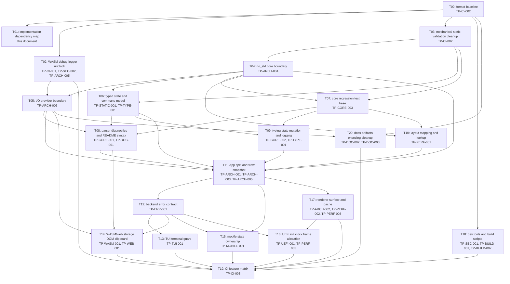

# typingmp 実装計画 2026-05-06

開始基準 commit: `4ffd73e style: run cargo fmt`

参照:

- [総レビュー目次](./fullreview20260505/index.md)
- [issue index](./fullreview20260505/issues/index.md)
- [refactor plan](./fullreview20260505/summary/refactor-plan.md)
- [no_std core と UI adapter 境界](./fullreview20260505/architecture/core-ui-boundary.md)
- [I/O 仮想化](./fullreview20260505/architecture/io-virtualization.md)
- [静的安全性](./fullreview20260505/quality/static-safety.md)

## 方針

P0/P1 は重要度であり、実施順ではない。実施順は、依存関係、再作業リスク、静的検査の効き方、no_std core と UI adapter の境界を基準に決める。

後方互換は不要である。不適切な既存設計を維持する adapter は作らない。暫定実装は許容するが、暫定の雑設計は禁止する。設計ミスが見つかった場合は、その設計を破棄して再設計する。

すべてのテキストファイルは UTF-8 として扱う。mojibake は修正対象であり、表示上の問題として流さない。

## 依存関係グラフ



## 実施順

| order | task | issue | depends on | 実施内容 | 完了条件 |
|---:|---|---|---|---|---|
| 0 | T00 format baseline | [TP-CI-002](./fullreview20260505/issues/items/ISS-20260505T000000Z-TP-CI-002-FMT-CLIPPY-GATE.md) | none | `cargo fmt` 単独 commit を作る。 | 完了済み。`4ffd73e style: run cargo fmt`。 |
| 1 | T01 dependency map | this document | T00 | issue 間の依存関係と実施順を固定する。 | 本文書が存在し、issue への参照がある。 |
| 2 | T02 WASM debug logger unblock | [TP-CI-001](./fullreview20260505/issues/items/ISS-20260505T000000Z-TP-CI-001-WASM-DEBUG-ENV.md), [TP-SEC-002](./fullreview20260505/issues/items/ISS-20260505T000000Z-TP-SEC-002-LOGGER-SERVER-DEV-ONLY.md), [TP-ARCH-005](./fullreview20260505/issues/items/ISS-20260505T000000Z-TP-ARCH-005-IO-PROVIDER-VFS.md) | T00 | `WEBSOCKET_ADDRESS` 未設定でも WASM debug build が通るようにする。logger は将来の provider 化と衝突しない最小境界にする。 | 完了済み。`cargo check --no-default-features --features wasm --target wasm32-unknown-unknown` が env 未設定で通る。 |
| 3 | T03 mechanical static-validation cleanup | [TP-CI-002](./fullreview20260505/issues/items/ISS-20260505T000000Z-TP-CI-002-FMT-CLIPPY-GATE.md) | T00 | 振る舞いを変えない clippy warning を先に潰す。unused import、redundant closure、`ptr_arg` などを対象にする。 | 完了済み。Clippy の機械的 warning を削減し、残りは T11 の API 境界修正対象に分離した。 |
| 4 | T04 no_std core boundary | [TP-ARCH-004](./fullreview20260505/issues/items/ISS-20260505T000000Z-TP-ARCH-004-NOSTD-CORE-UI-BOUNDARY.md) | T03 | parser / typing / model / layout を `core + alloc` 前提の module 群として整理する。crate 分割前でも `std` 混入を検出できる境界を作る。 | 完了済み。core 対象 module は `alloc` / `core` import に統一し、production の filesystem / DOM / terminal / firmware API 参照を外した。 |
| 5 | T05 I/O provider boundary | [TP-ARCH-005](./fullreview20260505/issues/items/ISS-20260505T000000Z-TP-ARCH-005-IO-PROVIDER-VFS.md), [TP-SEC-002](./fullreview20260505/issues/items/ISS-20260505T000000Z-TP-SEC-002-LOGGER-SERVER-DEV-ONLY.md) | T02, T04 | problem source、font asset、storage、clock、logger を provider trait として定義する。NEPLg2 の VFS / SourceMap 方針を typingmp に合わせる。 | 完了済み。`src/io.rs` に provider trait / typed id / repository を導入し、`App` は raw filesystem / font path / platform storage を直接前提にしない。 |
| 6 | T06 typed state and command model | [TP-STATIC-001](./fullreview20260505/issues/items/ISS-20260505T000000Z-TP-STATIC-001-ENUM-MATCH-STATE.md), [TP-TYPE-001](./fullreview20260505/issues/items/ISS-20260505T000000Z-TP-TYPE-001-I32-CURSOR-INDICES.md) | T03, T04 | cursor、menu item、source kind、UI command を enum / newtype に移す。raw number / raw string は adapter 境界で止める。 | 完了済み。typing cursor / menu / settings / UI command が enum / newtype 化され、adapter の raw string は `UiCommand` parse 境界で止まる。 |
| 7 | T07 core regression test base | [TP-CORE-003](./fullreview20260505/issues/items/ISS-20260505T000000Z-TP-CORE-003-TEST-COVERAGE-GAP.md) | T03, T04 | parser / typing / layout の pure test を追加する。以降の core 変更の防壁にする。 | 完了済み。typing / layout / app scene transition の regression test を追加し、`cargo test --no-default-features` が通る。 |
| 8 | T08 parser diagnostics and README syntax | [TP-CORE-001](./fullreview20260505/issues/items/ISS-20260505T000000Z-TP-CORE-001-PARSER-DIAGNOSTICS.md), [TP-DOC-001](./fullreview20260505/issues/items/ISS-20260505T000000Z-TP-DOC-001-README-NTQ-SYNTAX.md) | T05, T06, T07 | parser を `Result<Content, ParseDiagnostics>` に寄せ、README sample を `[base/reading]` に統一する。 | 完了済み。malformed input diagnostic test と README sample parse test が通る。 |
| 9 | T09 typing state mutation and logging | [TP-CORE-002](./fullreview20260505/issues/items/ISS-20260505T000000Z-TP-CORE-002-TYPING-MODEL-MOVE-LOGGING.md), [TP-TYPE-001](./fullreview20260505/issues/items/ISS-20260505T000000Z-TP-TYPE-001-I32-CURSOR-INDICES.md) | T06, T07 | `key_input` の model 値渡しを見直し、入力 log を optional / provider 境界に移す。 | 完了済み。`key_input` は `&mut TypingModel` と `TypingTransition` に移行し、default build で入力文字の log / `format!` allocation を行わない。 |
| 10 | T10 layout mapping and lookup | [TP-PERF-001](./fullreview20260505/issues/items/ISS-20260505T000000Z-TP-PERF-001-LAYOUT-REBUILD.md) | T04, T07 | layout mapping の runtime rebuild を減らす。static table / lazy / trie のどれが妥当かを実装で決める。 | 完了済み。default `Layout` は lazy 共有 `LayoutData` を参照し、layout lookup test が通る。 |
| 11 | T11 App split and view snapshot | [TP-ARCH-001](./fullreview20260505/issues/items/ISS-20260505T000000Z-TP-ARCH-001-APP-GOD-OBJECT.md), [TP-ARCH-003](./fullreview20260505/issues/items/ISS-20260505T000000Z-TP-ARCH-003-PUBLIC-PRIVATE-INTERFACE.md), [TP-ARCH-005](./fullreview20260505/issues/items/ISS-20260505T000000Z-TP-ARCH-005-IO-PROVIDER-VFS.md) | T05, T06, T08, T09, T10 | `App` を scene、problem repository、scroll、input、view snapshot に分ける。public field を減らす。 | 完了済み。`AppSnapshot`、`app/problems.rs`、`app/scroll.rs` を導入し、private interface warning が消えた。 |
| 12 | T12 backend error contract | [TP-ERR-001](./fullreview20260505/issues/items/ISS-20260505T000000Z-TP-ERR-001-BACKEND-UNWRAPS.md) | T11 | backend init / render / storage / asset failure の共通方針を決める。`unwrap()` を visible error または typed error に置き換える。 | 完了済み。`BackendError` と visible error report 経路を導入し、UEFI 以外の backend unwrap を解消した。 |
| 13 | T13 TUI terminal guard | [TP-TUI-001](./fullreview20260505/issues/items/ISS-20260505T000000Z-TP-TUI-001-TERMINAL-GUARD.md), [TP-ERR-001](./fullreview20260505/issues/items/ISS-20260505T000000Z-TP-ERR-001-BACKEND-UNWRAPS.md) | T12 | raw mode / alternate screen を RAII guard 化する。 | 完了済み。`TerminalGuard` の `Drop` で raw mode / alternate screen / cursor を復旧する。 |
| 14 | T14 WASM/web storage DOM clipboard | [TP-WASM-001](./fullreview20260505/issues/items/ISS-20260505T000000Z-TP-WASM-001-DOM-STORAGE-ERRORS.md), [TP-WEB-001](./fullreview20260505/issues/items/ISS-20260505T000000Z-TP-WEB-001-CLIPBOARD-SIDE-EFFECT.md), [TP-CORE-001](./fullreview20260505/issues/items/ISS-20260505T000000Z-TP-CORE-001-PARSER-DIAGNOSTICS.md) | T08, T12 | DOM / storage failure を visible error にし、自動 clipboard 書き込みを削除する。 | 完了済み。startup / storage failure は visible error 化し、clipboard side effect を削除した。 |
| 15 | T15 mobile state ownership | [TP-MOBILE-001](./fullreview20260505/issues/items/ISS-20260505T000000Z-TP-MOBILE-001-MUTEX-UI-STATE.md) | T11, T12 | Slint callback の `Arc<Mutex<App>>` と `.lock().unwrap()` を view snapshot / UI state model に寄せる。 | 完了済み。mobile backend state を `Rc<RefCell<App>>` に寄せ、mutex poison / lock unwrap 依存を解消した。 |
| 16 | T16 UEFI init clock frame allocation | [TP-UEFI-001](./fullreview20260505/issues/items/ISS-20260505T000000Z-TP-UEFI-001-FIRMWARE-PANIC-TIME.md), [TP-PERF-003](./fullreview20260505/issues/items/ISS-20260505T000000Z-TP-PERF-003-UEFI-FRAME-ALLOC.md), [TP-ERR-001](./fullreview20260505/issues/items/ISS-20260505T000000Z-TP-ERR-001-BACKEND-UNWRAPS.md) | T12, T17 | firmware API error、clock provider、frame buffer reuse を整理する。 | 完了済み。frame buffer reuse は T17 で完了済み。T16 では UEFI firmware API / font load failure を `Status` に変換し、UEFI timestamp の `unwrap()` と粗い年月計算を解消した。QEMU/OVMF は local toolchain に無いため smoke は未実行。 |
| 17 | T17 renderer surface and cache | [TP-ARCH-002](./fullreview20260505/issues/items/ISS-20260505T000000Z-TP-ARCH-002-RENDERER-DUPLICATION.md), [TP-PERF-002](./fullreview20260505/issues/items/ISS-20260505T000000Z-TP-PERF-002-TEXT-MEASURE-CACHE.md), [TP-PERF-003](./fullreview20260505/issues/items/ISS-20260505T000000Z-TP-PERF-003-UEFI-FRAME-ALLOC.md) | T11 | render surface abstraction と text / gradient cache を導入する。play 画面の上段表示と下段入力表示で同じ文字範囲の色状態がずれている問題もここで揃える。 | 完了済み。`ArgbSurface` / `RenderCache` に描画処理を集約し、上下 typing progress の色を文字単位で揃えた。 |
| 18 | T18 dev tools and build scripts | [TP-SEC-001](./fullreview20260505/issues/items/ISS-20260505T000000Z-TP-SEC-001-DEV-SERVER-PATH.md), [TP-BUILD-001](./fullreview20260505/issues/items/ISS-20260505T000000Z-TP-BUILD-001-BUILD-RS-UNWRAP-RERUN.md), [TP-BUILD-002](./fullreview20260505/issues/items/ISS-20260505T000000Z-TP-BUILD-002-UEFI-SCRIPTS-SAFETY.md) | T00 | dev server path guard、`build.rs` error、UEFI scripts の安全境界を直す。 | 完了済み。dev server path traversal test、strict `build.rs` clean build、UEFI script dry-run が通る。 |
| 19 | T19 CI feature matrix | [TP-CI-003](./fullreview20260505/issues/items/ISS-20260505T000000Z-TP-CI-003-WORKFLOW-MATRIX-ACTIONS.md), [TP-CI-002](./fullreview20260505/issues/items/ISS-20260505T000000Z-TP-CI-002-FMT-CLIPPY-GATE.md) | T02, T13, T14, T15, T16, T17, T18, T20 | feature / target matrix と no_std core check を CI に入れる。 | 完了済み。PR / main push の品質ゲート、feature matrix、WASM debug / release、UEFI no_std check を workflow と local script に追加した。 |
| 20 | T20 docs artifacts encoding cleanup | [TP-DOC-002](./fullreview20260505/issues/items/ISS-20260505T000000Z-TP-DOC-002-GENERATED-ARTIFACTS.md), [TP-DOC-003](./fullreview20260505/issues/items/ISS-20260505T000000Z-TP-DOC-003-CARGO-COMMENT-MOJIBAKE.md) | T00, T05 | generated artifact policy と UTF-8 comment cleanup を行う。 | 完了済み。tracked text の strict UTF-8 / mojibake 検査が通り、生成物は `.gitignore` と README の方針で管理される。 |

## 先に実施できる独立タスク

次は設計全体への依存が薄く、早期に進められる。ただし、暫定設計を入れてはいけない。

- T02: [TP-CI-001](./fullreview20260505/issues/items/ISS-20260505T000000Z-TP-CI-001-WASM-DEBUG-ENV.md) は build blocker なので早期修正する。ただし logger は T05 の provider 境界へ接続しやすい形にする。
- T18 のうち [TP-SEC-001](./fullreview20260505/issues/items/ISS-20260505T000000Z-TP-SEC-001-DEV-SERVER-PATH.md) は core 設計と独立している。
- T20 のうち [TP-DOC-003](./fullreview20260505/issues/items/ISS-20260505T000000Z-TP-DOC-003-CARGO-COMMENT-MOJIBAKE.md) は UTF-8 方針に従って早期に直せる。

## 設計確定後に実施するタスク

次は先に土台を作らないと再作業になりやすい。

- [TP-ARCH-001](./fullreview20260505/issues/items/ISS-20260505T000000Z-TP-ARCH-001-APP-GOD-OBJECT.md): `App` 分割は T05 / T06 / T08 / T09 後に行う。
- [TP-ARCH-002](./fullreview20260505/issues/items/ISS-20260505T000000Z-TP-ARCH-002-RENDERER-DUPLICATION.md): renderer 共通化は view snapshot 後に行う。
- [TP-MOBILE-001](./fullreview20260505/issues/items/ISS-20260505T000000Z-TP-MOBILE-001-MUTEX-UI-STATE.md): mobile state ownership は `App` snapshot 後に行う。
- [TP-UEFI-001](./fullreview20260505/issues/items/ISS-20260505T000000Z-TP-UEFI-001-FIRMWARE-PANIC-TIME.md) と [TP-PERF-003](./fullreview20260505/issues/items/ISS-20260505T000000Z-TP-PERF-003-UEFI-FRAME-ALLOC.md): UEFI は error contract と renderer surface 後に行う。

## 各タスクの完了時に更新するもの

実装 commit ごとに次を確認する。

- 対応 issue の front matter:
  - `status: fixed` は実装完了後。
  - `status: verified` と `resolved: true` は検証完了後。
- [issues/index.md](./fullreview20260505/issues/index.md)
- [issues/index.json](./fullreview20260505/issues/index.json)
- 関連レビュー章。例: T05 は [I/O 仮想化](./fullreview20260505/architecture/io-virtualization.md) を更新する。

## 検証コマンド

基本:

```powershell
cargo fmt --check
cargo test --no-default-features
cargo clippy --no-default-features --all-targets -- -W clippy::all
```

target 別:

```powershell
cargo check --no-default-features --features gui
cargo check --no-default-features --features tui
cargo check --no-default-features --features wasm --target wasm32-unknown-unknown
cargo check --no-default-features --features mobile
cargo check --no-default-features --features uefi --target x86_64-unknown-uefi
```

タスクごとの追加検証:

- T02: WASM check を `WEBSOCKET_ADDRESS` 未設定で実行する。
- T08: malformed parser fixture と README sample fixture を実行する。
- T13: terminal guard の failure path を確認する。
- T14: missing DOM / corrupt storage / clipboard side effect の web smoke を確認する。
- T16: QEMU UEFI smoke を確認する。
- T18: dev server traversal test と script dry-run を確認する。

## 停止条件

次のいずれかに当たった場合は、実装を続けず設計を見直す。

- 後方互換のために raw string / raw number state を残す必要が出た。
- core に filesystem、DOM、terminal、firmware API を入れる必要が出た。
- provider trait が target 固有の都合を持ち始めた。
- `match` の網羅性検査を避ける `_` arm が必要になった。
- `unwrap()` を残す理由が「現状そうなっているから」だけになった。
- test なしで typing core の挙動を変える必要が出た。
